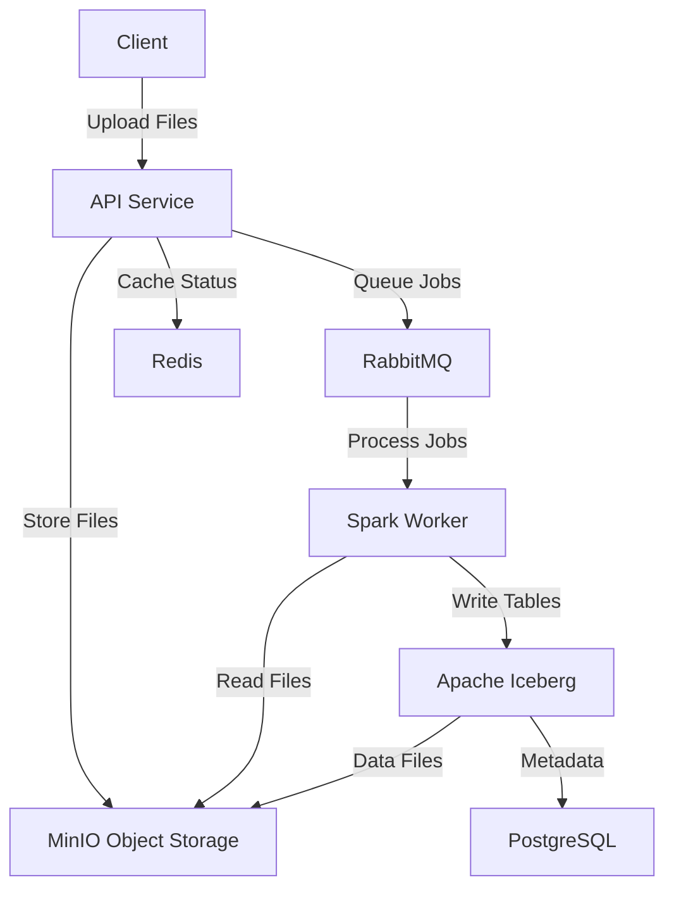

# Data Lakehouse 

A modern, scalable data lakehouse platform built with Apache Spark, Apache Iceberg, and Spring Boot. This platform provides a complete data ingestion and processing pipeline with real-time job management and cloud-native storage.

## Architecture



## Features

- **File Upload API**: RESTful API for uploading CSV, Excel, and other data files
- **Asynchronous Processing**: Queue-based job processing with RabbitMQ
- **Data Lakehouse**: Apache Iceberg tables with ACID transactions
- **Object Storage**: MinIO for scalable file and data storage
- **Real-time Monitoring**: Job status tracking with Redis caching
- **Cloud-Native**: Docker containerized microservices architecture
- **Scalable Processing**: Apache Spark for distributed data processing

## Technology Stack

### Backend Services
- **API Service**: Spring Boot 3.5.6, Java 17
- **Processing Engine**: Apache Spark 3.5.5 with Iceberg extensions
- **Message Queue**: RabbitMQ 3.13.7
- **Cache**: Redis 8.2.2
- **Database**: PostgreSQL 16

### Data Storage
- **Object Storage**: MinIO (S3-compatible)
- **Table Format**: Apache Iceberg 1.3.1
- **File Formats**: Parquet, CSV, Excel

### Infrastructure
- **Containerization**: Docker & Docker Compose
- **Build Tools**: Maven 3.9.4
- **Monitoring**: Spring Boot Actuator

## Prerequisites

- Docker 20.10+
- Docker Compose 2.0+
- 8GB+ RAM recommended
- 10GB+ disk space

## Quick Start

### 1. Clone the Repository
```bash
git clone https://github.com/mohamed20o03/data-lakehouse
cd data-lakehouse
```

### 2. Start the Platform
```bash
docker compose up --build -d
```

### 3. Verify Services
```bash
docker compose ps
```

All services should be in "Up" status:
- `api-service` (Port 8080)
- `minio` (Ports 9000, 9001)
- `postgres` (Port 5432)
- `rabbitmq` (Ports 5672, 15672)
- `redis` (Port 6380)
- `spark-worker`

### 4. Test the Platform
```bash
# Upload a test file
curl -X POST -F "file=@test_data.csv" -F "tableName=employees" \
  http://localhost:8080/api/v1/upload

# Check job status
curl http://localhost:8080/api/v1/jobs/{jobId}
```

## API Documentation

### Upload File
```http
POST /api/v1/upload
Content-Type: multipart/form-data

Parameters:
- file: Data file (CSV, Excel, etc.)
- tableName: Target table name (optional)
- userId: User identifier (optional)
```

**Response:**
```json
{
  "jobId": "uuid",
  "status": "queued"
}
```

### Get Job Status
```http
GET /api/v1/jobs/{jobId}
```

**Response:**
```json
{
  "jobId": "uuid",
  "userId": "anonymous",
  "fileName": "data.csv",
  "filePath": "uploads/uuid/data.csv",
  "tableName": "employees",
  "fileSize": 1024,
  "timestamp": "2025-10-23T09:38:23",
  "status": "queued",
  "message": "File received and queued"
}
```

### Health Check
```http
GET /actuator/health
```

## Configuration

### Environment Variables

#### API Service
- `SPRING_PROFILES_ACTIVE=prod`
- `MINIO_ENDPOINT=http://minio:9000`
- `MINIO_ACCESS_KEY=admin`
- `MINIO_SECRET_KEY=password123`

#### Spark Worker
- `MINIO_ENDPOINT=http://minio:9000`
- `MINIO_ACCESS_KEY=admin`
- `MINIO_SECRET_KEY=password123`
- `RABBITMQ_HOST=rabbitmq`
- `RABBITMQ_PORT=5672`
- `RABBITMQ_USER=admin`
- `RABBITMQ_PASS=password123`

### File Upload Limits
- Maximum file size: 100MB
- Supported formats: CSV, Excel (XLSX/XLS), Parquet, Avro

## Data Storage

### MinIO Buckets
- `uploads/`: Raw uploaded files
- `warehouse/`: Processed Iceberg tables

### Table Structure
```
warehouse/
└── wh/
    └── db/
        └── {tableName}/
            ├── data/
            │   └── *.parquet
            └── metadata/
                └── *.json
```

## Monitoring & Management

### Service URLs
- **API Service**: http://localhost:8080
- **MinIO Console**: http://localhost:9001 (admin/password123)
- **RabbitMQ Management**: http://localhost:15672 (admin/password123)
- **Spark UI**: http://localhost:4040 (when Spark job is running)

### Logs
```bash
# View all logs
docker compose logs

# View specific service logs
docker compose logs api-service
docker compose logs spark-worker
```

## Development

### Project Structure
```
data-lakehouse/
├── api-service/           # Spring Boot API service
│   ├── service/
│   │   ├── src/main/java/
│   │   └── pom.xml
│   └── Dockerfile
├── spark/                 # Spark processing engine
│   ├── worker-app/        # Spark worker application
│   ├── conf/             # Spark configuration
│   ├── jars/             # Additional JAR files
├── docker-compose.yml    # Service orchestration
└── README.md
```

### Building from Source
```bash
# Build API service
cd api-service
mvn clean package

# Build Spark worker
cd spark/worker-app
mvn clean package
```

### Adding New File Formats
1. Update `WorkerApp.java` to handle new format
2. Add required dependencies to `pom.xml`
3. Rebuild and deploy

## Security

### Default Credentials
- **MinIO**: admin/password123
- **RabbitMQ**: admin/password123
- **PostgreSQL**: iceberg_user/iceberg_pass

**Important**: Change default credentials in production!

### Network Security
- Services communicate via Docker internal network
- External ports exposed only for necessary services
- No direct database access from outside containers

## Scaling

### Horizontal Scaling
```bash
# Scale Spark workers
docker compose up --scale spark-worker=3 -d
```

### Resource Limits
Update `docker-compose.yml` to set memory and CPU limits:
```yaml
services:
  spark-worker:
    deploy:
      resources:
        limits:
          memory: 4G
          cpus: '2.0'
```

## Troubleshooting

### Common Issues

#### Services Not Starting
```bash
# Check service status
docker compose ps

# View logs for failed services
docker compose logs [service-name]
```

#### File Upload Fails
- Check file size (max 100MB)
- Verify file format is supported
- Ensure API service is healthy

#### Spark Worker Not Processing
- Check RabbitMQ connection
- Verify MinIO access
- Review Spark worker logs

#### Data Not Appearing in MinIO
- Check warehouse bucket permissions
- Verify Iceberg table creation
- Review Spark processing logs

### Performance Tuning

#### Spark Configuration
Update `spark/conf/spark-defaults.conf`:
```properties
spark.sql.adaptive.enabled=true
spark.sql.adaptive.coalescePartitions.enabled=true
spark.serializer=org.apache.spark.serializer.KryoSerializer
```

#### Memory Settings
```yaml
# In docker-compose.yml
services:
  spark-worker:
    environment:
      - SPARK_DRIVER_MEMORY=2g
      - SPARK_EXECUTOR_MEMORY=2g
```

## Contributing

1. Fork the repository
2. Create a feature branch
3. Make your changes
4. Add tests if applicable
5. Submit a pull request

## License

This project is licensed under the MIT License - see the LICENSE file for details.

## Support

For issues and questions:
1. Check the troubleshooting section
2. Review service logs
3. Open an issue on GitHub
4. Contact the development team

---

**Built with ❤️ for modern data engineering**
